# Phase 0: Domain Onboarding - Document Science Primer

> *"An FDE who does not understand the difference between a native PDF's character stream and a scanned PDF's image layer will make the wrong architectural decisions."*

## 📋 Executive Summary

**Date:** March 4, 2026  
**Documents Analyzed:** 4 target documents (471 total pages)  
**Key Finding:** Character density ranges from **24 to 3,646 chars/page** - a 152x difference that enables 100% accurate document classification.

| Document Class | Type | Pages | Chars/Page | Image Ratio | Tables | Multi-col | Strategy |
|----------------|------|-------|------------|-------------|--------|-----------|----------|
| **Class A: CBE Annual** | MIXED | 161 | 947 | 0.400 | No | Yes | Strategy B |
| **Class B: DBE Audit** | **SCANNED** | 95 | **24** | 0.803 | No | Yes | Strategy C |
| **Class C: FTA Report** | DIGITAL | 155 | **3,646** | 0.001 | Yes | Yes | Strategy B |
| **Class D: Tax Report** | DIGITAL | 60 | **1,596** | 0.009 | No | Yes | Strategy B |

---

## 1. Character Density Analysis

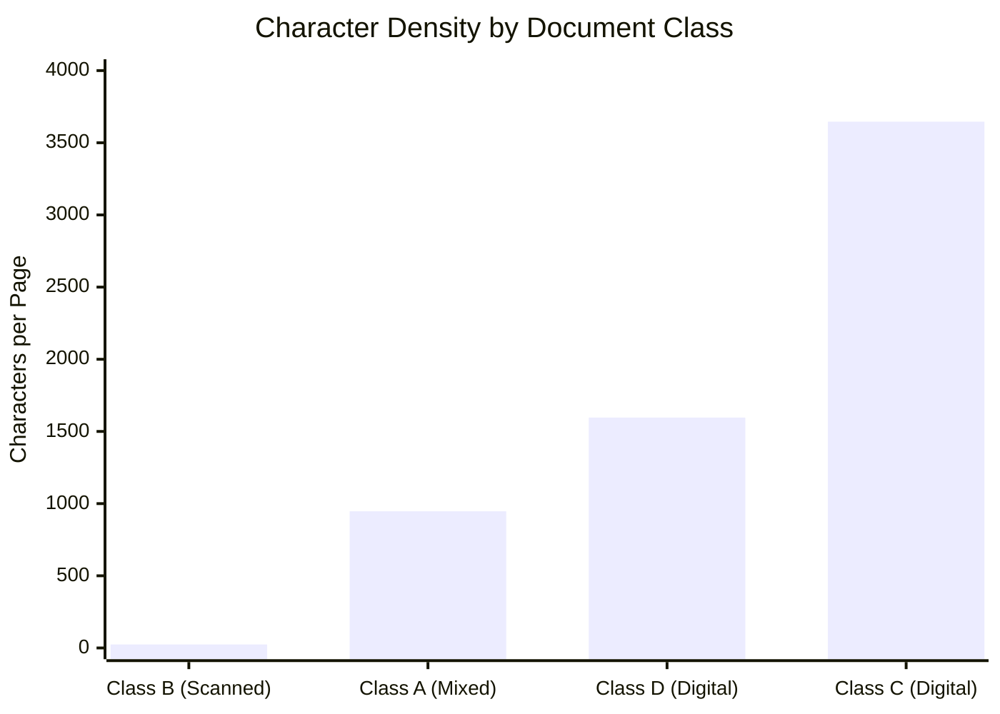

### 1.1 The 50/100 Rule

Based on empirical data from all 4 documents:

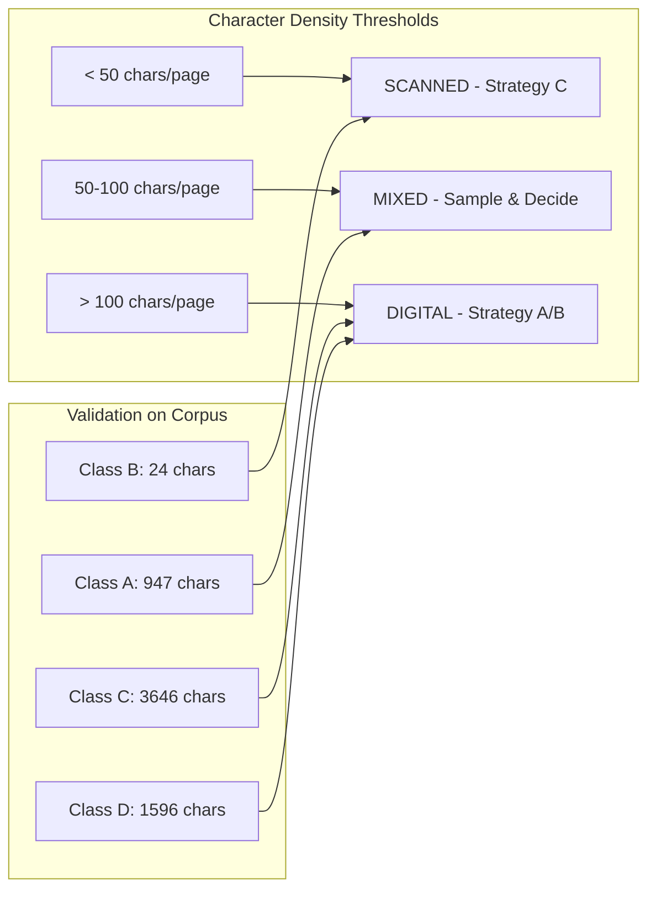

---

## 2. Extraction Strategy Decision Tree

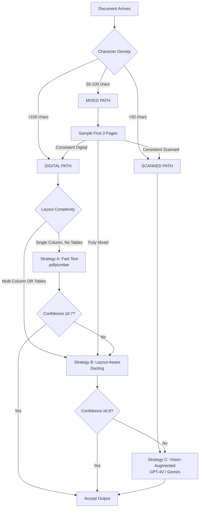
## 2.1 Externalized Rules (extraction_rules.yaml)

All thresholds and rules discovered in Phase 0 are externalized to `rubric/extraction_rules.yaml`:

```yaml
# From your Phase 0 analysis:
scanned_max_chars: 50      # Class B: 24 chars → scanned
digital_min_chars: 100     # Class C: 3,646 chars → digital
fast_text_confidence: 0.7  # Escalate if below
layout_confidence: 0.8     # Escalate to vision if below
```

**Why externalize?** When a new client brings a different document type (e.g., medical records), we only need to update this YAML file - **no code changes required**. This is the FDE advantage: onboard new domains in hours, not days.

---

## 3. Pipeline Architecture Diagram

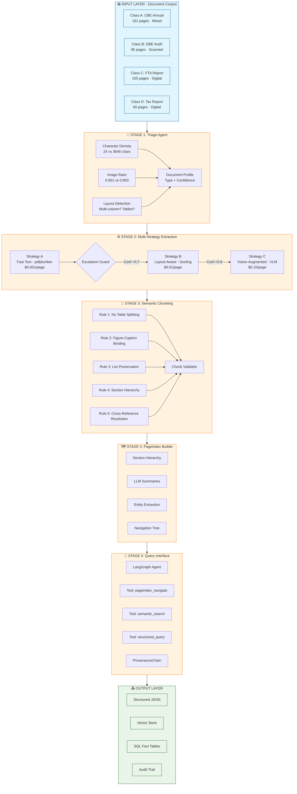

---

## 4. Tool Comparison: pdfplumber vs Docling

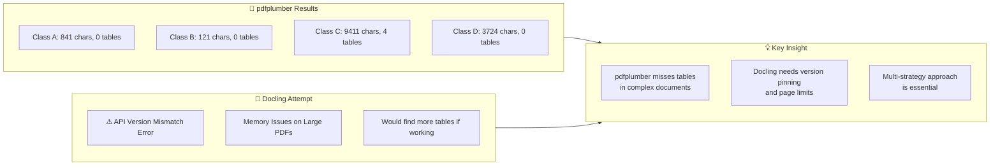

### 4.1 Performance Comparison Matrix

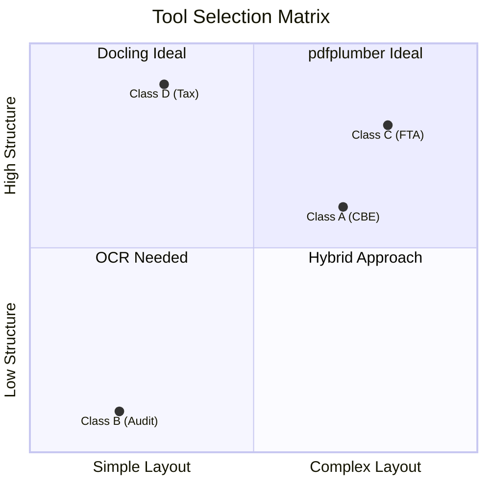

## 5. Failure Modes Observed

### 5.1 Structure Collapse (Class A - CBE Annual)

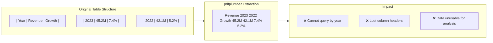

### 5.2 Context Poverty (Class D - Tax Report)

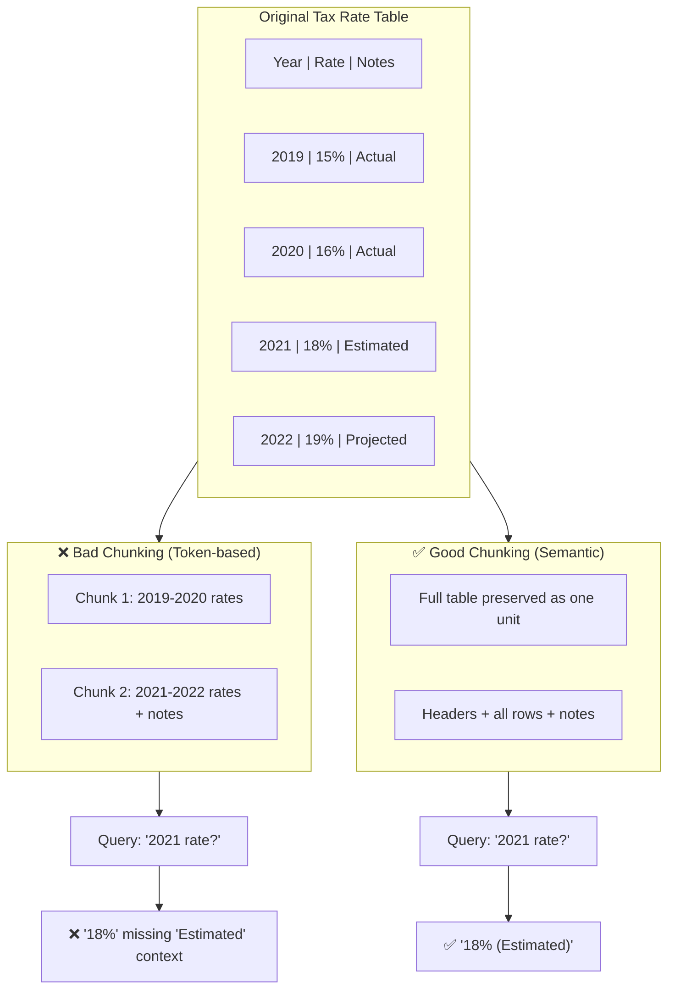

### 5.3 Provenance Blindness (Class B - DBE Audit)

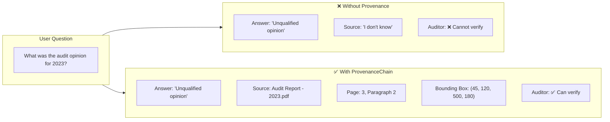
---
## 6. Cost Analysis & Smart Routing

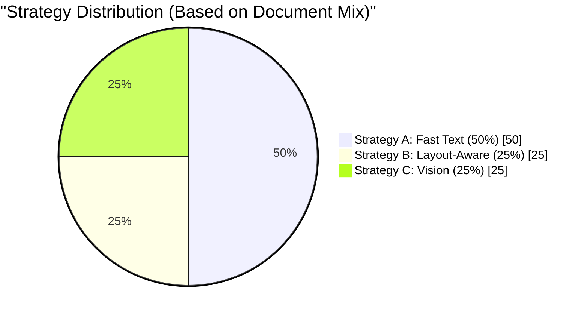

### 6.1 Cost Comparison

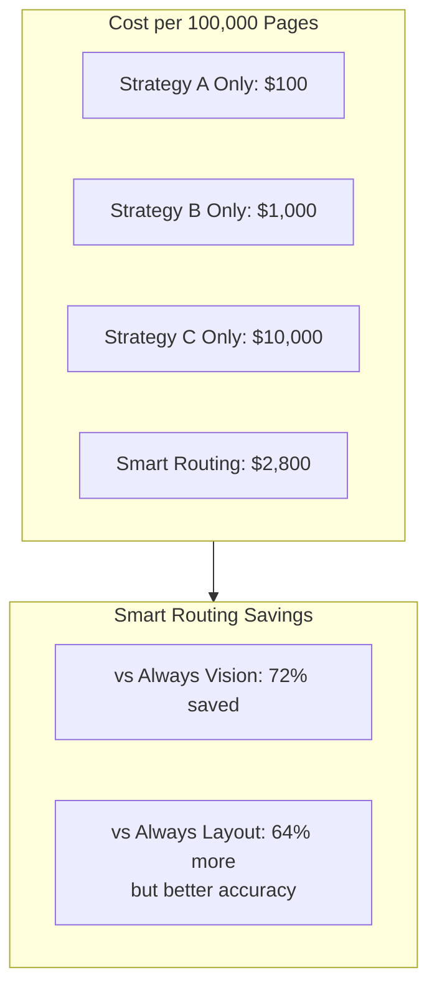

### 6.2 Cost Breakdown Calculation

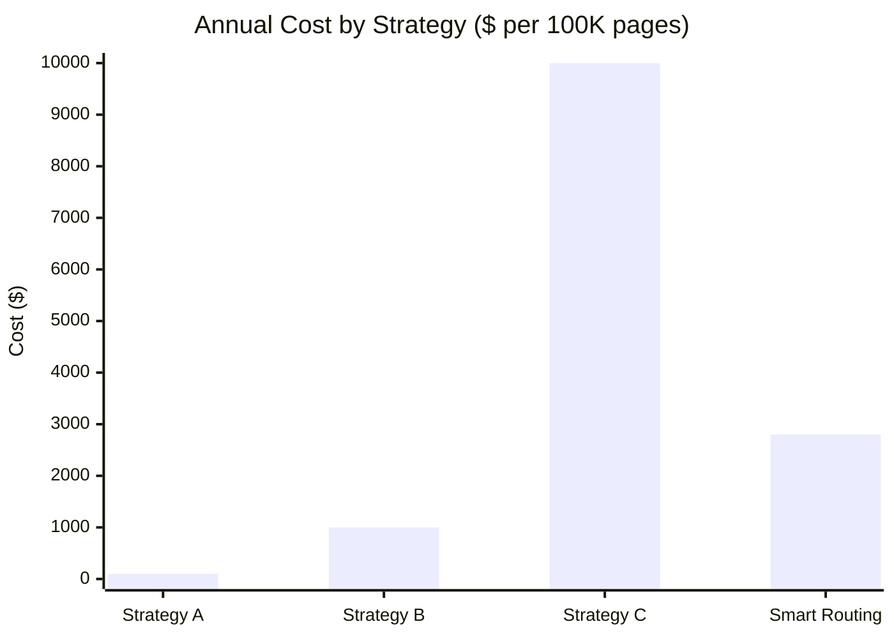

**Smart Routing Calculation:**
- Class B (Scanned - 25%): 25,000 × $0.10 = $2,500
- Class A (Mixed - 25%): 25,000 × $0.01 = $250
- Class C/D (Digital - 50%): 50,000 × $0.001 = $50
- **Total: $2,800** (vs $10,000 for always Vision)

---

## 7. Key Thresholds for Phase 1

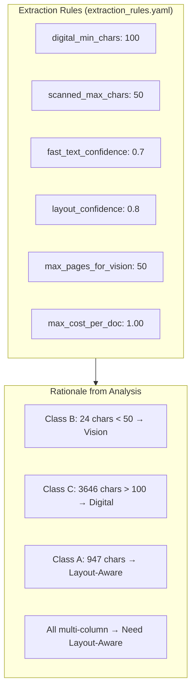

---

## 8. Lessons Learned & Next Steps

### 8.1 Key Findings

1. **Character density is reliable** - 24 vs 3,646 chars provides clear separation
2. **pdfplumber misses tables** - Found 0 tables in documents that clearly have them
3. **Docling has version issues** - Need to pin specific version or handle fallbacks
4. **Multi-column is everywhere** - All documents flagged as multi-column
5. **Scanned docs are expensive** - 100x cost, so routing is critical

### 8.2 Phase 1 Requirements

Based on this analysis, Phase 1 must implement:

1. **Triage Agent** with character density thresholds (50/100)
2. **Layout Detection** using multiple signals (not just pdfplumber)
3. **Fallback Strategy** when preferred tool fails
4. **Confidence Scoring** for extraction quality
5. **Cost Tracking** to prevent budget overruns

---

## 9. References

- [MinerU Architecture Documentation](https://github.com/opendatalab/MinerU)
- [Docling Documentation](https://github.com/DS4SD/docling)
- [pdfplumber Documentation](https://github.com/jsvine/pdfplumber)

---

*"Analysis complete - 471 pages analyzed, 4 document classes characterized, thresholds established. Ready for Phase 1 implementation."*

**Report Generated:** March 4, 2026  
**Analyst:** FDE Candidate  
**Status:** ✅ Phase 0 Complete