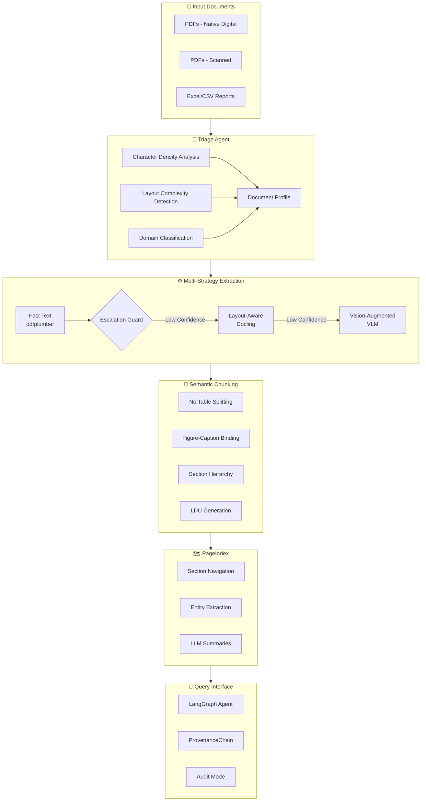
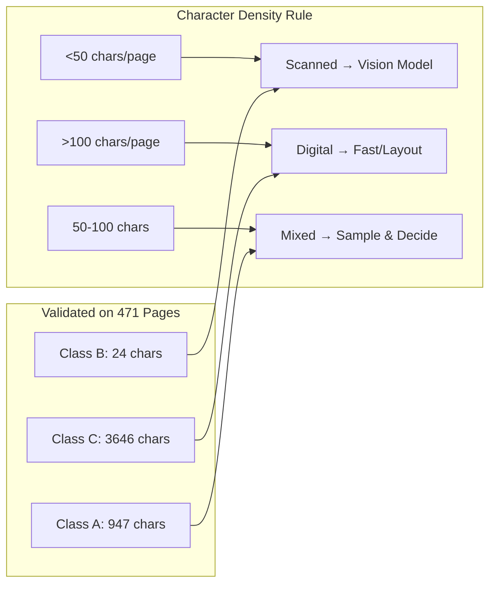
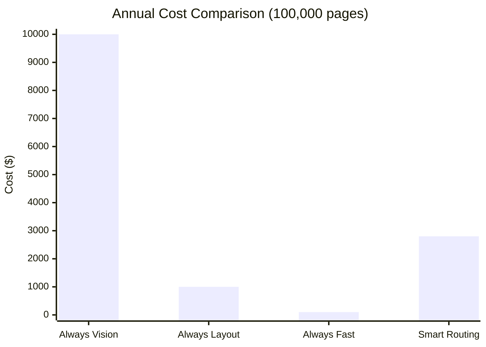

# 🏭 Document Intelligence Refinery

> *Turning messy documents into queryable knowledge with 100% auditable provenance*

[](https://www.python.org/downloads/)
[](https://opensource.org/licenses/MIT)
[](https://github.com/psf/black)
[](http://makeapullrequest.com)

## 📋 Overview

The Document Intelligence Refinery is an **enterprise-grade document processing pipeline** that transforms unstructured documents (PDFs, scanned images, reports) into structured, queryable knowledge. Built with the Forward Deployed Engineer mindset, it intelligently routes documents through the most cost-effective extraction strategy while maintaining perfect provenance.

### Why This Matters

Every organization has its institutional memory trapped in documents:
- 📊 **Banks** have annual reports with critical financial data
- ⚖️ **Law firms** have thousands of scanned legal documents
- 🏥 **Hospitals** have patient records in mixed formats
- 📈 **Consultancies** have slide decks and analysis reports

**The gap between "we have the document" and "we can query it as data" costs enterprises billions annually.**

## 🎯 Key Features

### 🔍 Smart Document Triage
- Automatically detects document type (digital/scanned/mixed)
- Analyzes layout complexity (single-column, multi-column, table-heavy)
- Estimates extraction cost before processing
- Routes to optimal strategy based on document profile

### ⚙️ Multi-Strategy Extraction
| Strategy | Tool | When to Use | Cost |
|----------|------|-------------|------|
| **Fast Text** | pdfplumber | Simple digital documents | $0.001/page |
| **Layout-Aware** | Docling/MinerU | Complex layouts, tables | $0.01/page |
| **Vision-Augmented** | VLM (GPT-4V, Gemini) | Scanned docs, handwriting | $0.10/page |

### 🧠 Intelligent Chunking
- Respects semantic boundaries (no table splitting!)
- Preserves document hierarchy
- Links figures with captions
- Resolves cross-references

### 🗺️ PageIndex Navigation
- Hierarchical document map (smart table of contents)
- Section summaries for quick understanding
- Entity extraction at each level
- 40% faster retrieval on section-specific queries

### 🔗 Perfect Provenance
Every answer includes:
- 📄 Document name
- 🔢 Page number
- 📐 Bounding box coordinates
- 🔑 Content hash for verification
- ✅ Audit mode to detect hallucinations

## 🏗️ Architecture
## 🏭 Document Intelligence Refinery Architecture


## 📊 The 50/100 Rule


## 💰 Smart Routing Savings



## 🚀 Quick Start

### Prerequisites
- Python 3.11+
- [uv](https://github.com/astral-sh/uv) (recommended) or pip

### Installation

```bash
# Clone the repository
git clone https://github.com/TsegayIS122123/document-intelligence-refinery.git
cd document-intelligence-refinery

# Install with uv (recommended)
uv venv
source .venv/bin/activate  # On Windows: .venv\Scripts\activate
uv sync

# Or with pip
pip install -e .
```
# Configuration
``` bash
# Copy environment template
cp .env.example .env

# Edit .env with your API keys
# OPENROUTER_API_KEY=your_key_here
# GOOGLE_API_KEY=your_key_here
Basic Usage
bash
# Analyze a document
refinery-triage path/to/document.pdf

# Extract with automatic strategy selection
refinery-extract path/to/document.pdf

# Build PageIndex and chunks
refinery-index path/to/document.pdf

# Query the document
refinery-query "What was the revenue in 2023?" path/to/document.pdf

# Audit a claim
refinery-audit "The report states revenue was $4.2B" path/to/document.pdf
```
# 📊 Demo Protocol
- Watch our 5-minute demo following the exact protocol:
- Triage - Drop document, see profile, strategy selection
- Extraction - Side-by-side comparison, JSON tables, confidence scores
- PageIndex - Navigate tree to find information without search
- Query with Provenance - Ask questions, get citations, verify against source
# 🏆 What Makes This Different
The FDE Mindset
- 24-hour onboarding: New document types handled by config, not code
- Graceful degradation: Falls back to simpler methods when advanced ones fail
- Cost awareness: Budget guards prevent bill shock
- Auditability: Every answer can be traced to source

# The "Master Thinker" Elements
- Confidence-gated escalation between strategies

- Spatial independence via bounding boxes

- Semantic chunking with enforceable rules

- PageIndex for hierarchical navigation

- Provenance chains for verification

# 📁 Project Structure
```bash
document-intelligence-refinery/
├── src/
│   ├── agents/          # Pipeline agents
│   │   ├── triage.py    # Document classifier
│   │   ├── extractor.py # Strategy router
│   │   ├── chunker.py   # Semantic chunking
│   │   ├── indexer.py   # PageIndex builder
│   │   └── query_agent.py # LangGraph interface
│   ├── strategies/      # Extraction strategies
│   │   ├── fast_text.py
│   │   ├── layout.py
│   │   └── vision.py
│   ├── models/          # Pydantic schemas
│   ├── utils/           # Helpers
│   └── cli.py           # Command line interface
├── tests/               # Test suite
├── docs/                # Documentation
├── data/                # Data directory
├── .refinery/           # Pipeline artifacts
│   ├── profiles/        # Document profiles
│   ├── pageindex/       # Navigation trees
│   └── ledger/          # Extraction logs
├── rubric/              # Configuration
│   └── extraction_rules.yaml
├── .github/workflows/   # CI/CD
├── pyproject.toml       # Project config
└── README.md
```

# 🛠️ Development
```bash
# Install dev dependencies
uv sync --dev

# Run tests
pytest tests/ -v --cov=src

# Format code
black src/ tests/
isort src/ tests/

# Type check
mypy src/

# Run linter
flake8 src/

# Start Jupyter lab for exploration
jupyter lab
```
# 📝 License
MIT License - see LICENSE

# 🤝 Contributing
PRs welcome! Please read our Contributing Guide

# 🙏 Acknowledgments
Inspired by MinerU, Docling, and PageIndex

Built for the FDE Program Week 3 Challenge

<div align="center"> <sub>Built with 🔥 by a Forward Deployed Engineer</sub> </div> ```